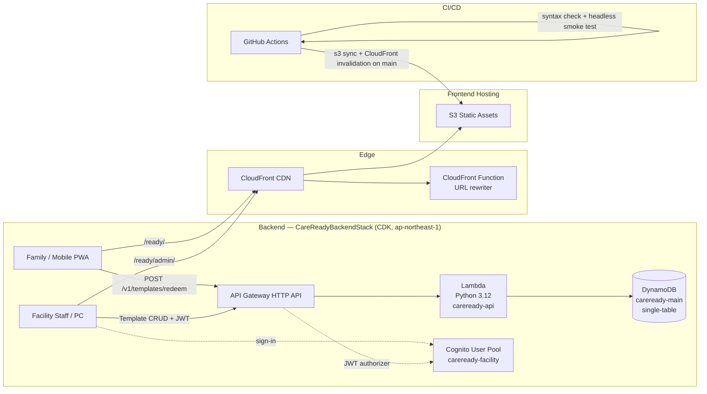

# CareReady — Dynamic Belongings Checklist for Care Facility Transfers

A serverless PWA that helps family caregivers prepare and verify personal belongings when an
older relative moves between care settings (hospital admission, short stay, day service, facility admission).
Facility staff publish a template via a 6-character share code; families redeem it on any
browser—no app install, no login required.

**Status:** Public web MVP · [https://veai.jp/ready/](https://veai.jp/ready/)

---

## Status & Limitations

| State | Detail |
|---|---|
| Released | Family-facing PWA checklist with IndexedDB persistence, facility template redeem via share code, return-check mode, and CI/CD to S3/CloudFront |
| Working | Backend CRUD API (Lambda + DynamoDB) with Cognito JWT auth for staff, deployed to `ap-northeast-1` |
| In progress | Facility admin portal (`/ready/admin/`) — template editor and QR poster generation |
| Future | Multi-facility onboarding flow, accessibility improvements, native app packaging |

The family-facing web MVP is public and usable. Facility onboarding and admin workflows remain
in development. CareReady is not a medical device and does not make clinical recommendations.

The checklist can be printed with the printer button. The print view includes the current location's
visible belongings, checkboxes, quantities, container labels, and any saved free memo; it is generated
locally in the browser and does not upload the list.

---

## Product Management

CareReady doubles as a working **product-management portfolio** — a real product taken from problem to
deployed system, solo and AI-assisted, with the delivery discipline kept in public. Start with the
**[PM case study](docs/13_product_management_case_study.md)**. What it demonstrates:

- **Evidence-based delivery** — features are gated on pilot evidence, not opinion; scope is controlled
  explicitly; and the boundary between "working software" and "finished service" is kept visible. The
  case study states outcome evidence *and* what is not yet validated.
- **Stakeholder management** — two users with conflicting needs: families who need zero-friction,
  no-login use, and facility staff who publish belongings templates via a 6-character share code. The
  design serves both without an account wall — a trade-off made explicit rather than hidden.
- **Technical product management** — architecture and delivery decisions owned end to end: an
  offline-first PWA over a serverless backend (Lambda + DynamoDB + Cognito), CI/CD to S3/CloudFront,
  and an explicit cache/trust boundary (see **Architecture** below and the case study's technical-PM section).
- **Agile in practice** — a live **[GitHub Project — CareReady Product Delivery](https://github.com/users/larai-w/projects/2)**
  run as **experiments, decisions, tasks and risks** (priority p0–p2, phase labels) with a traceable
  Definition of Ready / Definition of Done — see the
  **[operating model](docs/14_github_project_operating_model.md)** and the
  **[issues](https://github.com/larai-w/careready-belongings-checker/issues)**.

Delivery write-ups (architecture, evidence-based scope decisions, technical trade-offs) are on the
[VEAI LAB blog](https://veai.jp/blog/).

Release evidence is separated into automated checks and human gates in the
[public release checklist](docs/21_release_evidence_checklist.md); passing CI does not claim pilot or clinical outcomes.

## VEAI Ecosystem PM Evidence

CareReady is also one product in a broader VEAI care-technology ecosystem. The ecosystem is managed
as a public-safe technical product-management portfolio, with product repositories remaining the
source of implementation evidence and Projects tracking outcomes, dependencies, risks, and release gates.

The operating model demonstrates:

- **Traceable delivery governance** — Issues and Projects are checked for user stories, acceptance
  criteria, ownership, and delivery status.
- **Evidence-based prioritisation** — experiments, decisions, tasks, and risks are kept distinct so
  roadmap changes can be tied to observable evidence.
- **Privacy-aware automation** — audits and KPI summaries use counts and public metadata while
  excluding personal, facility, and raw care data.
- **Release discipline** — dependency audits, workflow-security checks, accessibility contracts, product-contract checks, smoke tests, and deployment evidence are
  reviewed before release decisions.
- **Portfolio learning** — recurring findings are tracked over time to show whether delivery hygiene
  and risk controls improve.

This is evidence of technical product-management practice and delivery governance. It is not a claim
of clinical effectiveness, facility adoption, or medical-device status. See the public
[CareReady Product Delivery Project](https://github.com/users/larai-w/projects/2),
[CareReady issues](https://github.com/larai-w/careready-belongings-checker/issues), and the
[CareReady PM case study](docs/13_product_management_case_study.md) for public implementation evidence.

---

## Architecture



**DynamoDB key design:**

| Pattern | PK | SK | GSI1PK |
|---|---|---|---|
| Facility template | `FAC#<facilityId>` | `TPL#<tplId>` | `CODE#<shareCode>` |

GSI1 resolves a 6-character share code (alphanumeric, `I/O/0/1` excluded) to the full
template without knowing the facility ID — this is the public redeem path.

---

## Tech Stack

| Layer | Technology |
|---|---|
| Frontend | Vanilla JS PWA, Service Worker, IndexedDB |
| Hosting | AWS S3 + CloudFront + CloudFront Functions |
| API | AWS API Gateway HTTP API + Lambda (Python 3.12, boto3 only) |
| Database | DynamoDB single-table, on-demand billing, `RemovalPolicy.RETAIN` |
| Auth | AWS Cognito User Pool (admin-managed sign-up, email + password) |
| IaC | AWS CDK v2 (Python) — `backend/infra/` |
| CI/CD | GitHub Actions — headless Chrome smoke tests + S3 deploy |

---

## API Routes

| Method | Path | Auth | Purpose |
|---|---|---|---|
| `POST` | `/v1/templates/redeem` | None | Resolve share code → template |
| `GET` | `/v1/facility/templates` | Cognito JWT | List facility templates |
| `POST` | `/v1/facility/templates` | Cognito JWT | Create template (generates share code) |
| `GET/PUT/DELETE` | `/v1/facility/templates/{tplId}` | Cognito JWT | Read / update / delete |

Validation limits: name ≤ 100 chars, items ≤ 200 entries, item name ≤ 100 chars.

---

## Testing

Backend: **pytest + moto** (mocked DynamoDB). 9 test cases covering:

- `POST /v1/templates/redeem` — happy path and 404
- Facility template CRUD round-trip (create → get → update → delete → 404)
- Input validation (empty name, >200 items, item name >100 chars)
- `facilityId` fallback to Cognito `sub` when `custom:facilityId` is absent

```bash
# Run backend tests
python -m venv backend/.venv && source backend/.venv/bin/activate
pip install --prefer-binary aws-cdk-lib constructs pytest moto boto3
python -m pytest backend/tests/ -q
```

Frontend CI: syntax check + headless Chrome smoke test on every push (GitHub Actions).

---

## Local Development

```bash
# Frontend (static, no build step required)
python3 -m http.server 8000   # serves index.html from repo root
# or open index.html directly in a browser

# Backend CDK synthesis (no AWS credentials needed)
cd backend/infra
source ../.venv/bin/activate
cdk synth --quiet
```

Set `DYNAMODB_ENDPOINT` to a local DynamoDB instance to run Lambda locally.
CORS allows `http://localhost:8000` in addition to `https://veai.jp`.

---

## Deployment

```bash
cd backend/infra
source ../.venv/bin/activate

# First time only
cdk bootstrap aws://<ACCOUNT_ID>/ap-northeast-1

cdk deploy
```

CDK outputs: `ApiUrl`, `UserPoolId`, `UserPoolClientId`, `TableName`.

Frontend: GitHub Actions deploys to S3 on push to `main` and invalidates CloudFront.

---

## 日本語

高齢者やケアを受ける方が施設入所・帰宅する際に、家族が使う持ち物チェッカー PWA です。
施設スタッフが管理ポータルでテンプレートを作り、6 文字のシェアコードを配布すると、
家族がコードを入力するだけで施設専用リストを取り込めます。IndexedDB でオフライン動作し、
「返却チェックモード」で未返却品を確認できます。
バックエンドは AWS CDK で管理する完全サーバーレス構成（Lambda + DynamoDB + Cognito）。

---

## License

MIT License

---

Part of the [VEAI LAB.](https://veai.jp) ecosystem · [Product page](https://veai.jp/apps/careready/)
