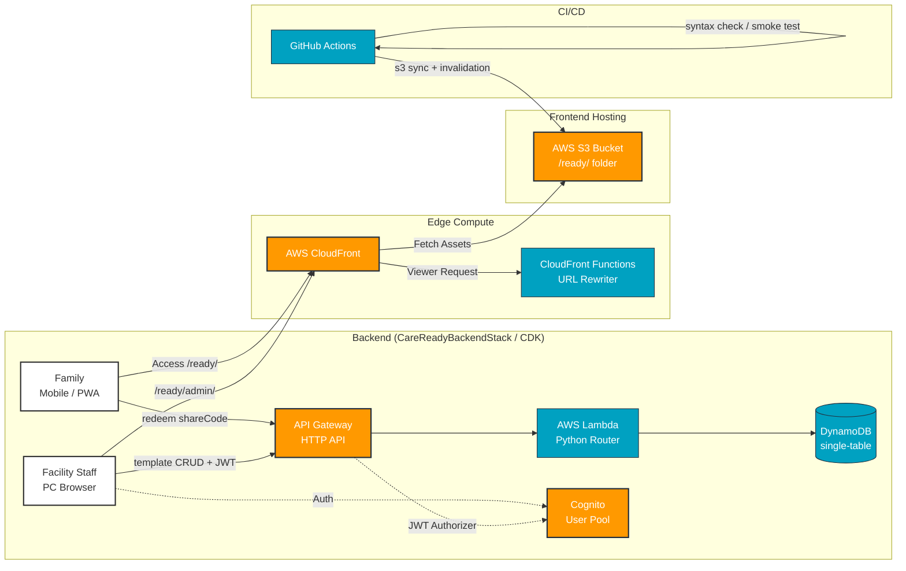

# CareReady // Offline-First Belongings Checker for Care Transitions
### // ショートステイ・入院・施設入所などの持ち物チェッカー //

  

An offline-first, AWS serverless belongings workflow for families and care facilities preparing for care-related stays and transitions.

CareReady is not limited to a particular disease or diagnosis. It supports practical preparation and return checks for situations such as short stays, hospital stays, residential care admissions, and day services; it does not provide clinical advice or replace facility instructions.

**🌐 Live: https://veai.jp/ready/**

---

## 📊 System Architecture Primitives (MSCS Focus)

This project demonstrates a secure, highly-available AWS Serverless primitives infrastructure with a full CI/CD pipeline.

### 🛠️ Key Infrastructure primitives:
*   **CloudFront & CloudFront Functions:** CDN for fast content delivery and Edge Computing primitives for URL re-writing (clean URLs like `/ready/`).
*   **AWS S3:** Highly scalable primitives for frontend static website hosting.
*   **API Gateway (HTTP API) + Lambda (Python):** Serverless REST API for facility template distribution (`POST /v1/templates/redeem`, facility CRUD) and OCR-assisted item import.
*   **DynamoDB (single-table design):** Facility templates resolved by 6-char shareCode via GSI. On-demand billing, `RemovalPolicy.RETAIN`.
*   **Cognito:** JWT-based authentication for facility staff (email + password, admin-managed sign-up).
*   **OpenAI Vision API / optional Textract:** Experimental paper-list OCR. Uploaded images are not persisted; extracted candidates are user-reviewed before becoming custom items.
*   **AWS CDK (Python):** Full infrastructure-as-code — `backend/infra/` ([deploy guide](backend/README.md)).
*   **GitHub Actions CI/CD:** Syntax checks + headless-Chrome smoke tests on every push; auto-deploy to S3 with CloudFront invalidation on `main`.

---

## 🌟 PMP Approach & Deliverables

Agile development (Scrum) methodology is used. This demonstrates PMP skills in defining deliverables and managing stakeholders.

*   **Tailoring:** Feature-based grey-out functional primitives ('Not Needed'), profile-level condition toggles (e.g. diaper use), and check memory (IndexedDB primitives) for enhanced integration control.
*   **Traceability:** Container (Box) management with custom naming, sorting views, and **return-check mode** to ensure asset traceability across facility transfers (lost-item prevention).
*   **Quality Management:** Acceptance criteria, automated CI smoke tests, backend tests, and production API checks provide technical evidence. The full real-device facility-to-family walkthrough remains a release gate.

### Product management evidence

CareReady is managed as a solo, AI-assisted, evidence-driven product. The repository separates delivered software from validated outcomes and links product decisions to user stories, cloud architecture, release gates, commits, tests, and pilot evidence.

*   [Product Management Case Study](docs/13_product_management_case_study.md) — problem framing, prioritisation, traceability, risk management, delivery evidence, and honest limitations.
*   [GitHub Project Operating Model](docs/14_github_project_operating_model.md) — Issue Forms, Project fields, workflow policies, automation, and the current pilot backlog.
*   [User Stories](docs/04_ユーザーストーリー.md) — original epics, acceptance criteria, and discovery notes.

This evidence supports an agile Product Owner / technical Product Manager portfolio. It does not claim a multi-person Scrum team, clinical validation, or proven health outcomes.

---

## 🚀 Current Feature Set

### For Families (PWA, no login required)
*   [x] Location-based checklists (Short stay / Hospital / Day service) with progress tracking
*   [x] Custom items with quantity badges, per-item 'Not Needed' toggle
*   [x] Container (box) assignment, custom box naming, sort-by-container view
*   [x] **Return-check mode** — verify everything came back home; consumables auto-excluded; copy an inquiry message for unreturned items
*   [x] **Facility code redeem** — enter a 6-char code (or scan QR / open `?fc=CODE` URL) to receive the facility's official list
*   [x] **Paper-list OCR import** — photograph a facility handout, review extracted candidates, and add selected items as custom checklist entries
*   [x] Condition toggles (e.g. "uses diapers") that show/hide related items across all views
*   [x] Print-ready A4 output, LINE share, light/dark theme, offline-first (Service Worker + IndexedDB)

### For Facilities (Admin Portal: `/ready/admin/`)
*   [x] Template editor — hide standard items, add facility-specific items, attach notices
*   [x] shareCode + QR code distribution (printable poster)

### Docs
*   📁 [Public project documentation](docs/README.md) — user stories, architecture, engineering guidance, and sanitised product-management evidence
*   🔧 [Development guide](docs/DEVELOPMENT.md) / [Backend deploy guide](backend/README.md)

> **Summary:** This demonstrates PM skills in defining functional primitives and MSCS skills in delivering secure, data-driven serverless solutions through agile development.
