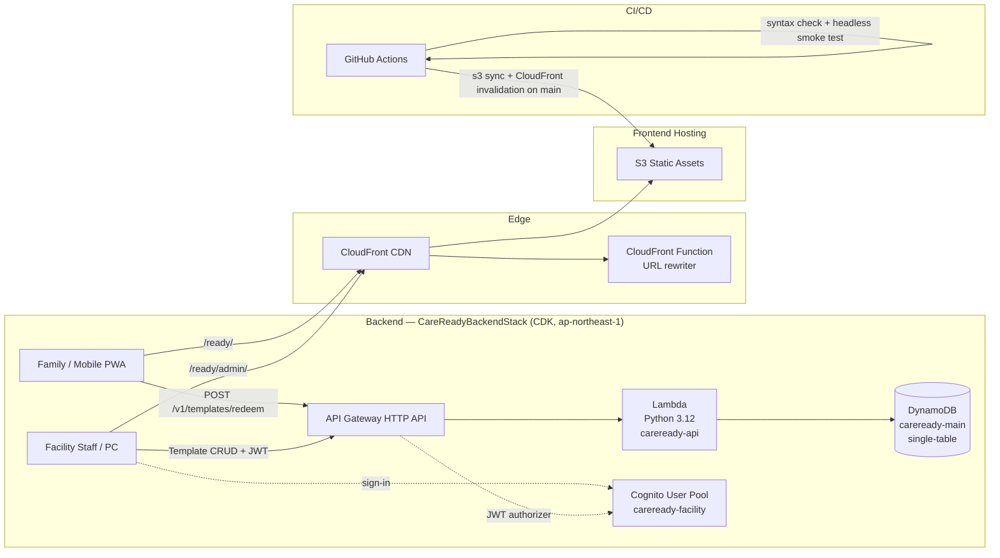

# 🧳 CareReady — Dynamic Belongings Checklist for Care Facility Transfers

[日本語](README.ja.md) · [Local development](#local-development) · [App](https://veai.jp/ready/)

A serverless PWA that helps family caregivers prepare and verify personal belongings when an
older relative moves between care settings (hospital admission, short stay, day service, facility admission).
Facility staff publish a template via a 6-character share code; families redeem it on any
browser—no app install, no family login required. The user interface is Japanese.
The core checklist works with bundled data; facility-code redemption and image reading are separate network-backed features.

**Status:** Public web MVP · [https://veai.jp/ready/](https://veai.jp/ready/)

### Open-source collaboration

- **Home Assistant** — **Merged** PR: [Accessible names for analytics consent switches](https://github.com/home-assistant/frontend/pull/54083)
- **Microduck** — **Merged** PR: [Fresh camera snapshots through robotctl and console HTTP](https://github.com/pollen-robotics/microduck/pull/241)
- **stack-chan** — **In review** PR: [Deterministic sample sync for gallery output](https://github.com/stack-chan/stack-chan/pull/702)

### Contributing

Contributions are welcome. See [CONTRIBUTING](./CONTRIBUTING.md).

- Quick start for first contributions: open an issue with the [Good first issue](https://github.com/larai-w/careready-belongings-checker/issues/new/choose) template.
- For code changes, open a pull request from [Compare changes](https://github.com/larai-w/careready-belongings-checker/compare).

---

## Status & Limitations

| State | Detail |
|---|---|
| Released | Family-facing PWA checklist with IndexedDB persistence, facility template redeem via share code, return-check mode, preparation JSON backup/restore, and CI/CD to S3/CloudFront |
| Working | Backend CRUD API (Lambda + DynamoDB) with Cognito JWT auth for staff, deployed to `ap-northeast-1` |
| In progress | Facility admin portal (`/ready/admin/`) — template editor and QR poster generation |
| Scope boundary | Facility onboarding and admin availability must be assessed separately from the public family checklist |

The family-facing web MVP is public and usable. Facility onboarding and admin workflows remain
in development. CareReady is not a medical device and does not make clinical recommendations.

The checklist can be printed with the printer button. The print view includes the current location's
visible belongings, checkboxes, quantities, container labels, and any saved free memo; it is generated
locally in the browser and does not upload the list.

---

## Preparation backup and restore

Families can [save and restore preparation](https://veai.jp/ready/#backup) without an account.
Open “準備データの保存・復元へ”, choose “1. 今の準備をファイルに保存” to download a JSON backup,
or select a saved file under “2. 保存したファイルから戻す” to review it before restoring.

- **Included:** custom belongings and containers, preparation and return checks, container assignments,
  packed-bag state, conditions, plans, and the facility template.
- **Excluded:** diary entries, photos, the person-name field, free-form personal memos, and notification
  preferences. Existing destination values outside the backup remain unchanged.
- **Replacement, not automatic sync:** a successful restore replaces the preparation covered by the file.
  Export the current preparation first if you may want to return to it. Cancellation leaves it unchanged.
  The existing list-sharing flow does not include check states; the backup does.
- **File limits and handling:** CareReady version 1 JSON, up to 2 MB. Files can contain sensitive item names,
  plans, and facility details. Keep them appropriately; clearing browser data does not delete exported copies.

Restore checks the confirmation against current stored values and writes them in one IndexedDB transaction.
The localStorage fallback supports export but refuses multi-key restore. The item-add dialog supports
Escape cancellation, and service-worker cache cleanup is scoped to CareReady caches.

[Development and test instructions](docs/DEVELOPMENT.md) describe the storage behavior and browser checks.
Automated tests do not establish real-world usability or clinical outcomes.

---

## Product Management

CareReady doubles as a working **product-management portfolio** — a real product taken from problem to
deployed system, solo and AI-assisted, with the delivery discipline kept in public. Start with the
**[PM case study](docs/13_product_management_case_study.md)**. What it demonstrates:

- **Evidence-based delivery** — features are gated on pilot evidence, not opinion; scope is controlled
  explicitly; and the boundary between "working software" and "finished service" is kept visible. The
  case study states outcome evidence *and* what is not yet validated.
- **Stakeholder management** — two users with conflicting needs: families who need zero-friction,
  no-login use, and facility staff who publish belongings templates via a 6-character share code. The
  design serves both without an account wall — a trade-off made explicit rather than hidden.
- **Technical product management** — architecture and delivery decisions owned end to end: an
  offline-first PWA over a serverless backend (Lambda + DynamoDB + Cognito), CI/CD to S3/CloudFront,
  and an explicit cache/trust boundary (see **Architecture** below and the case study's technical-PM section).
- **Agile in practice** — a live **[GitHub Project — CareReady Product Delivery](https://github.com/users/larai-w/projects/2)**
  run as **experiments, decisions, tasks and risks** (priority p0–p2, phase labels) with a traceable
  Definition of Ready / Definition of Done — see the
  **[operating model](docs/14_github_project_operating_model.md)** and the
  **[issues](https://github.com/larai-w/careready-belongings-checker/issues)**.

Delivery write-ups (architecture, evidence-based scope decisions, technical trade-offs) are on the
[VEAI LAB blog](https://veai.jp/blog/).

Release evidence is separated into automated checks and human gates in the
[public release checklist](docs/21_release_evidence_checklist.md); passing CI does not claim pilot or clinical outcomes.

## VEAI Ecosystem PM Evidence

CareReady is also one product in a broader VEAI care-technology ecosystem. The ecosystem is managed
as a public-safe technical product-management portfolio, with product repositories remaining the
source of implementation evidence and Projects tracking outcomes, dependencies, risks, and release gates.

The operating model demonstrates:

- **Traceable delivery governance** — Issues and Projects are checked for user stories, acceptance
  criteria, ownership, and delivery status.
- **Evidence-based prioritisation** — experiments, decisions, tasks, and risks are kept distinct so
  roadmap changes can be tied to observable evidence.
- **Privacy-aware automation** — audits and KPI summaries use counts and public metadata while
  excluding personal, facility, and raw care data.
- **Release discipline** — dependency audits, workflow-security checks, accessibility contracts, product-contract checks, smoke tests, and deployment evidence are
  reviewed before release decisions.
- **Portfolio learning** — recurring findings are tracked over time to show whether delivery hygiene
  and risk controls improve.

This is evidence of technical product-management practice and delivery governance. It is not a claim
of clinical effectiveness, facility adoption, or medical-device status. See the public
[CareReady Product Delivery Project](https://github.com/users/larai-w/projects/2),
[CareReady issues](https://github.com/larai-w/careready-belongings-checker/issues), and the
[CareReady PM case study](docs/13_product_management_case_study.md) for public implementation evidence.

---

## Architecture



**DynamoDB key design:**

| Pattern | PK | SK | GSI1PK |
|---|---|---|---|
| Facility template | `FAC#<facilityId>` | `TPL#<tplId>` | `CODE#<shareCode>` |

GSI1 resolves a 6-character share code (alphanumeric, `I/O/0/1` excluded) to the full
template without knowing the facility ID — this is the public redeem path.

---

## Tech Stack

| Layer | Technology |
|---|---|
| Frontend | Vanilla JS PWA, Service Worker, IndexedDB |
| Hosting | AWS S3 + CloudFront + CloudFront Functions |
| API | AWS API Gateway HTTP API + Lambda (Python 3.12, boto3 only) |
| Database | DynamoDB single-table, on-demand billing, `RemovalPolicy.RETAIN` |
| Auth | AWS Cognito User Pool (admin-managed sign-up, email + password) |
| IaC | AWS CDK v2 (Python) — `backend/infra/` |
| CI/CD | GitHub Actions — headless Chrome smoke tests + S3 deploy |

---

## API Routes

| Method | Path | Auth | Purpose |
|---|---|---|---|
| `POST` | `/v1/templates/redeem` | None | Resolve share code → template |
| `GET` | `/v1/facility/templates` | Cognito JWT | List facility templates |
| `POST` | `/v1/facility/templates` | Cognito JWT | Create template (generates share code) |
| `GET/PUT/DELETE` | `/v1/facility/templates/{tplId}` | Cognito JWT | Read / update / delete |

Validation limits: name ≤ 100 chars, items ≤ 200 entries, item name ≤ 100 chars.

---

## Testing and engineering evidence

The existing checks cover distinct layers. Their presence does not establish live service health or human usability.

| Concern | Source / checks |
| --- | --- |
| Checklist filtering and progress | [Checklist logic](lib/checklist.js), [tests](tests/checklist.test.js) |
| Sharing without check states | [Share contract](lib/share.js), [tests](tests/share.test.js) |
| Preparation backup boundaries | [Backup format](lib/backup.js), [tests](tests/backup.test.js) |
| Atomic restore and storage fallback | [Storage](storage.js), [browser checks](tests/backup.browser.cjs) |
| Offline update and cache isolation | [Service worker](sw.js), [browser checks](tests/backup-offline.browser.cjs) |
| OCR candidate matching | [Matching logic](lib/ocr-match.js), [tests](tests/ocr-match.test.js) |
| Backend request handling | [Python handler](backend/src/handler.py), [pytest checks](backend/tests/test_handler.py) |

Frontend checks use Node's built-in test runner:

```bash
npm test
```

No frontend dependency installation or build step is required. Browser scenarios require a separately supplied Playwright installation; see [development instructions](docs/DEVELOPMENT.md). Do not infer that all browser scenarios run in CI: [the workflow](.github/workflows/ci.yml) specifies the actual syntax, unit, backend, contract and headless-browser jobs.

Backend test dependencies are pinned separately:

```bash
python3 -m venv backend/.venv
backend/.venv/bin/python -m pip install -r backend/requirements-test.lock.txt
backend/.venv/bin/python -m pytest backend/tests/ -q
```

These are instructions for running the existing checks, not a report of their latest results.

## Local Development

Requirements for the frontend: Git and Python 3. Use Node.js for JavaScript checks. The frontend is vanilla JavaScript with ES modules; no bundler is needed.

```bash
git clone https://github.com/larai-w/careready-belongings-checker.git
cd careready-belongings-checker
python3 -m http.server 8000 --bind 127.0.0.1
```

Open **http://localhost:8000/**. Stop with `Ctrl+C`. Use HTTP rather than `file://` so ES modules and service-worker behavior can work normally. Offline availability requires a successful initial load/cache and does not cover every network-backed feature.

### Explore the core flow

In a separate browser profile, use invented belongings:

1. Select a care setting and check an item.
2. Add an item or container, adjust its quantity and assign it to a bag.
3. Switch to the return-check view and inspect what remains to bring home.
4. Export a preparation JSON file, then inspect the restore confirmation before choosing whether to replace the covered preparation state.
5. Preview printing to see the visible list, quantities and container labels.

Do not use real names or facility information for development. These steps are an exploration guide, not new usability evidence.

### Local versus network-backed features

| Path | Data boundary |
| --- | --- |
| Core checklist | `API_URL` is empty by default, so definitions come from bundled `data.json`; device state is stored through `storage.js` |
| JSON backup and print | Generated locally; exported files can contain sensitive belongings or plans |
| List sharing | Different from backup: the share contract does not include preparation check states |
| Facility share code | Calls the backend to retrieve a template; staff CRUD uses Cognito JWT authentication |
| Image reading | Sends a selected, resized image to the OCR API; review extracted candidates before adding them |
| Optional notifications / feedback | Network requests; not part of an entirely offline path |

`API_BASE` in `app.js` points to a deployed backend, independently of `API_URL`. A localhost page is therefore **not automatically isolated from production**. Keep local exploration to core checklist/backup/print, or explicitly configure an isolated backend before exercising share-code redemption, OCR, notifications, feedback or staff administration. Do not submit test records or images to the live service.

The page loads Tailwind from a CDN. A first load with no network is not a guaranteed offline installation.

### Backend development and synthesis

Backend setup is separate from the static frontend. Inspect [the handler](backend/src/handler.py), [CDK stack](backend/infra/stacks/careready_backend_stack.py), and [backend documentation](backend/README.md).

For template synthesis, install the pinned CDK Python dependencies in the virtual environment above:

```bash
backend/.venv/bin/python -m pip install -r backend/infra/requirements.lock.txt
source backend/.venv/bin/activate
cd backend/infra
npx --yes aws-cdk@2 synth --quiet
```

The `npx` command may download the CLI. Synthesis writes CloudFormation templates; it is not deployment. A local DynamoDB endpoint alone does not supply an HTTP server, staff authentication or an isolated OCR provider.

## Deployment boundary

On a push to `main`, [CI](.github/workflows/ci.yml) runs its `check` job; a successful result then invokes [the reusable deployment workflow](.github/workflows/deploy-steps.yml). It versions the service-worker cache and publishes the frontend to S3/CloudFront using GitHub OIDC. Manual frontend deployment is also available.

**Documentation-only changes merged to `main` can therefore deploy the frontend.** Branch publication and PR review are separate from the production merge decision. CDK/backend releases are also separate; see [backend documentation](backend/README.md) and the [backend workflow](.github/workflows/deploy-backend.yml). Do not run bootstrap, deploy or live API examples as part of ordinary README exploration.

## Repository guide

| Location | Purpose |
| --- | --- |
| `index.html`, `app.js` | Japanese interface and application flow |
| `storage.js`, `sw.js` | Persistence and cache/update behavior |
| `lib/` | Checklist, sharing, OCR matching, backup and export modules |
| `admin/` | Staff-facing template interface |
| `backend/` | Python API, AWS CDK and backend checks |
| `tests/` | Pure logic and browser scenarios |
| `docs/` | Public technical guides and delivery evidence |

Keep care data, private working notes and credentials outside public issues, PRs and fixtures. See [CONTRIBUTING.md](CONTRIBUTING.md).

---

## 日本語

機能、保存・復元の範囲、開発手順は [日本語README](README.ja.md) にまとめています。

---

## License

MIT License

---

Part of the [VEAI LAB.](https://veai.jp) ecosystem · [Product page](https://veai.jp/apps/careready/)
