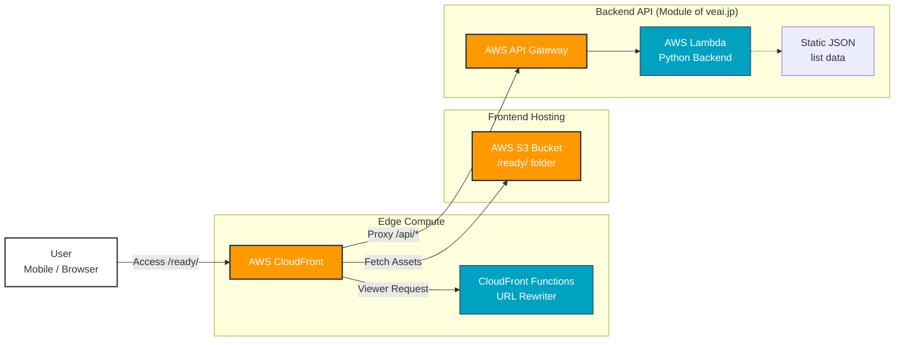

# CareReady // Dynamic Belongings Checker for Parkinson's
### // パーキンソン病患者の施設入所時における動的持ち物チェッカー //

  

AWS Serverless belongings checker designed for Parkinson's Disease patients during facility transfers to aid caregivers.
---

## 📊 System Architecture Primitives (MSCS Focus)

This project demonstrates a secure, highly-available AWS Serverless primitives infrastructure.

### 🛠️ Key Infrastructure primitives:
*   **CloudFront & CloudFront Functions:** CDN for fast content delivery and Edge Computing primitives for URL re-writing (clean URLs like `/ready/`).
*   **AWS S3:** Highly scalable primitives for frontend static website hosting.
*   **AWS API Gateway:** Secure primitives for backend API entry point.
*   **AWS Lambda:** Serverless primitives for dynamic list generation based on location constraints.

---

## 🌟 PMP Approach & Deliverables

Agile development (Scrum) methodology is used. This demonstrations PMP skills in defining deliverables and managing stakeholders.

*   **Tailoring:** Feature-based grey-out functional primitives ('Not Needed') and check memory (localStorage primitives) for enhanced integration control.
*   **Traceability:** Functional primitives for Container (Box) management and sorting to ensure asset traceability across facility transfers.
*   **Quality Management:** Primitives verified through agile acceptance criteria reviews with stakeholders (helpers).

---

### 🚀 CareReady // MVP Phase 2 // Memory & Tailoring Functions

This update integrates critical user feedback from caregivers (stakeholders) to enhance usability and provide better project control (Tailoring). This project demonstrates PMP skills in integration and stakeholder management.

#### Key Functional Primitives (Features)
*   [x] **Checkbox State Memory:** Primitives for checkbox states are persisted across page refreshes using localStorage.
*   [x] **'Not Needed' Toggle per Item:** Each item can be toggled as 'Not Needed', which are then greyed out and excluded from the total count in the progress bar. This allows situation-based tailoring of deliverables.
*   [x] **Container (Box) Management & Sorting:** A dropdown for box selection (Box 1-4, None, etc.) is added to each item, and states are persisted. A 'Sort by Container' view is implemented, grouping items by box and showing count. This enhances integration control for caregivers.

#### Acceptance Criteria

The following deliverables are verified as complete. This demonstrates PMP quality management skills.
*   [x] Checkbox states are persisted across page refreshes.
*   [x] Items can be toggled as 'Not Needed', which are then greyed out and excluded from the progress bar.
*   [x] A dropdown for box selection (Box 1-4, None, etc.) is added to each item, and states are persisted.
*   [x] A 'Sort by Container' view is implemented, grouping items by box and showing count.
*   [x] The URL is cleaned using CloudFront Functions for `https://veai.jp/ready/index.html` to `https://veai.jp/ready/`. This demonstrates AWS Serverless primitives skills (MSCS).

> **Summary:** This demonstrates PM skills in defining functional primitives and MSCS skills in delivering secure, data-driven solutions through agile development.
