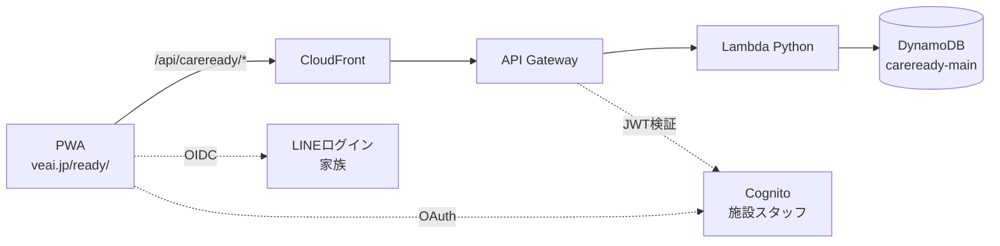

# CareReady バックエンド設計書
— 施設アカウント・マルチユーザー・DB対応(Phase 3)—

## 1. 目的とスコープ

現在のCareReadyは完全クライアントサイド(IndexedDB保存、URL共有)。本設計はこれを以下に拡張する:

| # | 提供価値 | 対象 |
|---|---|---|
| 1 | 施設が公式持ち物リストを作成・QR/URL配布できる | 施設(有料) |
| 2 | 施設が利用家族の準備状況を一覧できる | 施設(有料) |
| 3 | チェック状態・カスタムアイテムが端末間で同期される | 家族(無料〜プレミアム) |
| 4 | 家族間で同じリストを共同編集できる | 家族(無料) |

**スコープ外(将来)**: リアルタイム同時編集、AI生成、LINE通知(設計上の拡張点だけ§9に記載)。

## 2. 全体アーキテクチャ

既存のveai.jpインフラ(CloudFront + S3 + API Gateway + Lambda)に素直に乗せる。



- **Lambda**: Python 3.13 / 単一関数 + ルーター(小規模のうちはモノリスLambdaが運用最軽量)
- **認可**: API GatewayのJWTオーソライザー。家族トークン(LINE→自前JWT交換)と施設トークン(Cognito)を`aud`で区別

## 3. 認証設計

| ユーザー種別 | 方式 | 理由 |
|---|---|---|
| 家族 | **LINEログイン(OIDC)** | ターゲット層(50〜70代)の心理障壁が最小。パスワード管理不要 |
| 施設スタッフ | **Cognito(メール+パスワード)** | 施設は業務でLINE個人アカウントを使えないことが多い。PCブラウザ前提 |
| 未ログイン家族 | **匿名利用を維持** | 現在のIndexedDBローカル動作をそのまま残す。ログインは同期・共有したくなった時点で誘導 |

LINEログインのフロー: LIFF/OIDCでLINEのIDトークン取得 → Lambdaで検証 → 自前JWT(24h)発行。LINEのuserIdはハッシュ化して保存し、生のLINE IDはDBに置かない。

## 4. データモデル(DynamoDB シングルテーブル)

### 4.1 アクセスパターン(設計の起点)

| AP | クエリ | 頻度 |
|---|---|---|
| AP1 | 家族: 自分のリスト一覧・状態を取得 | 高 |
| AP2 | 家族: チェック/不要/箱/カスタムを更新 | 高 |
| AP3 | 家族: 施設テンプレを取り込む(コード指定) | 中 |
| AP4 | 施設: 自施設のテンプレCRUD | 低 |
| AP5 | 施設: テンプレを取り込んだ家族の準備状況一覧 | 中 |
| AP6 | 家族: 共有相手(家族B)を自分のリストに招待 | 低 |

### 4.2 テーブル定義 `careready-main`

| エンティティ | PK | SK | 主な属性 |
|---|---|---|---|
| 施設 | `FAC#<facId>` | `META` | name, plan, createdAt |
| 施設スタッフ | `FAC#<facId>` | `STAFF#<cognitoSub>` | role |
| 施設テンプレ | `FAC#<facId>` | `TPL#<tplId>` | name, items[], overrides{}, shareCode, updatedAt |
| 家族ユーザー | `USER#<userId>` | `META` | displayName, lineHash |
| 個人リスト | `USER#<userId>` | `LIST#<listId>` | name, baseTplRef, customItems[], checks{}, skips{}, containers{}, containerNames{}, returnChecks{}, updatedAt, members[] |
| テンプレ取込記録 | `TPL#<tplId>` | `SUB#<userId>` | listRef, progress, updatedAt |

**GSI1** (`shareCode` → テンプレ解決): PK=`CODE#<shareCode>`。家族がQRの6桁コードでテンプレを引く(AP3)。
**GSI2** (共同編集): PK=`MEMBER#<userId>`, SK=`LIST#<listId>`。招待されたリストの逆引き(AP6)。

### 4.3 設計判断

- **チェック状態はリストアイテム内のMap属性**(`checks.itemId = true` をUpdateExpressionで部分更新)。リスト全体は数KBに収まる規模なのでWCU効率より単純さを優先。1操作=1書き込み
- **施設の準備状況一覧(AP5)** は家族側の書き込み時に `TPL#<tplId>/SUB#<userId>` の progress を非正規化更新(DynamoDB Streamsは使わずLambda内で2書き込み。規模が出たらStreamsに移行)
- **プライバシー設計**: 施設から見えるのは「表示名(家族が設定した呼び名)と進捗%」のみ。チェック内容の明細・要介護度・医療情報はスキーマ自体に持たない。これが施設導入時の個人情報ハードルを下げる

## 5. 3層リストマージモデル(カスタマイズの仕組みの核)

「施設ごとのリスト + 個人の追加」は3層のマージで実現する:

```
① 標準テンプレ (data.json 相当。システム提供)
② 施設オーバーライド (施設テンプレの overrides{} + items[])
      - hide: 標準アイテムの非表示 (「うちはシャンプー持込不可」)
      - qty:  数量の指定 (「おむつ ×15」)
      - note: 施設ルール注記 (「全てに名前記入」)
      - add:  施設独自アイテム
③ 個人差分 (customItems[] / skips{} / checks{})
```

マージは**クライアント側で実施**(①はバンドル済み、②③をAPIから取得)。サーバーはマージ済みリストを持たない=施設テンプレ更新が即座に全家族へ反映される。現在の `data.json` スキーマ+customItemsがそのまま①③になるため、**既存クライアントコードの延長で実装できる**。

## 6. API設計

ベースパス: `https://veai.jp/api/careready/v1`

| Method | Path | 認可 | 用途 |
|---|---|---|---|
| POST | `/auth/line` | なし | LINEトークン→自前JWT交換 |
| GET | `/me/lists` | 家族 | リスト一覧 (AP1) |
| GET | `/me/lists/{id}` | 家族 | リスト詳細+状態 |
| PATCH | `/me/lists/{id}/state` | 家族 | checks/skips/containers差分更新 (AP2) |
| PUT | `/me/lists/{id}/custom-items` | 家族 | カスタムアイテム更新 |
| POST | `/me/lists/{id}/members` | 家族 | 家族招待 (AP6) |
| POST | `/templates/redeem` | 家族 | shareCodeでテンプレ取込 (AP3) |
| GET/POST/PUT | `/facility/templates` | 施設 | テンプレCRUD (AP4) |
| GET | `/facility/templates/{id}/subscribers` | 施設 | 準備状況一覧 (AP5) |

- PATCH `/state` は `{op: "check", itemId, value, clientUpdatedAt}` の配列を受けるバッチ形式。オフライン中の操作をキューして再接続時にまとめて送る
- 競合解決: **アイテム単位のlast-write-wins**(clientUpdatedAt比較)。チェックリストの特性上、これで実用十分

## 7. クライアント同期戦略(オフラインファースト維持)

```
UI操作 → メモリ(即時反映) → IndexedDB(即時) → 同期キュー → オンライン時にPATCH
```

- **IndexedDBは今後も一次キャッシュ**。オフラインで全機能が動く現在の性質を絶対に壊さない(施設内は電波が弱い)
- 未ログインユーザーは現状のまま完全ローカル動作。ログイン時に既存ローカルデータをそのまま初回アップロード(現在のlocalStorage→IndexedDB移行と同じパターン)
- storage.js に syncQueue を足す形で拡張。既存の getState/setState のインターフェースは変えない

## 8. 段階的実装計画と工数

| ステップ | 内容 | 工数(AI活用込み) |
|---|---|---|
| B-1 | CDKでDynamoDB+Lambda+API Gateway雛形、`/templates/redeem` と施設テンプレCRUDのみ | 4人日 |
| B-2 | 施設向け管理画面(テンプレ編集+shareCode/QR発行)※認証はCognito固定1施設で開始 | 5人日 |
| B-3 | クライアント: 3層マージ+テンプレ取込UI | 4人日 |
| B-4 | LINEログイン+個人リスト同期(syncQueue) | 6人日 |
| B-5 | 準備状況ダッシュボード(AP5)+家族招待 | 5人日 |
| — | **合計** | **約24人日(≒1.2人月)** |

**B-1〜B-3だけで「施設がリストを配れる」が完成する**(家族側はログイン不要のまま)。ここでパイロット施設に当ててから B-4/B-5 に進むのが低リスク。

## 9. 将来の拡張点(今は作らない、塞がない)

- LINE通知: 公式LINE(@775deusn)のMessaging APIから前日リマインド。SUB レコードに ステイ日付属性を足すだけで載る
- AI生成: `/me/lists/generate` を足し、LambdaからClaude API呼び出し(キーはSecrets Manager)
- リアルタイム共同編集: PATCH/stateをAppSync or WebSocket APIに差し替え可能な粒度にしてある

## 10. ランニングコスト試算(月)

| 項目 | 想定(施設10・家族1,000人) | 金額 |
|---|---|---|
| DynamoDB(オンデマンド) | 数百万リクエスト以下 | 〜300円 |
| Lambda + API Gateway | 同上 | 〜500円 |
| Cognito | MAU 50(施設スタッフ) | 0円(無料枠) |
| **合計** | | **月1,000円未満** |

施設プラン(月3,000〜10,000円)×1件で黒字。インフラコストは事業判断に影響しない水準。
