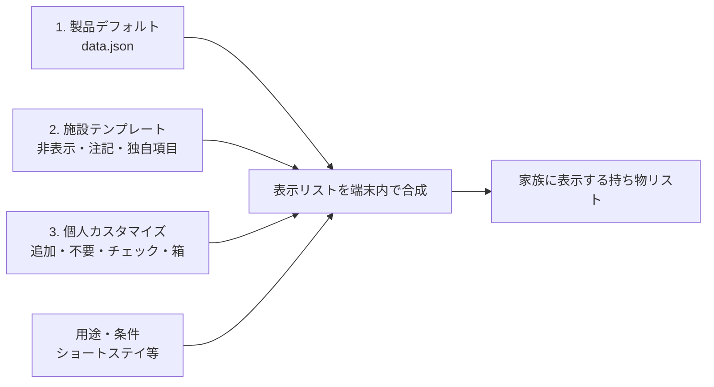
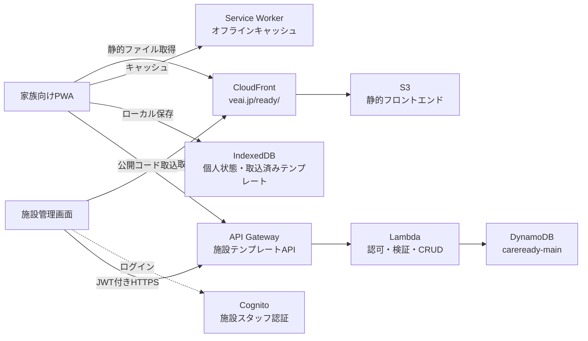
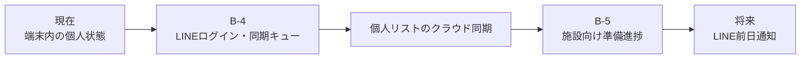

# 持ち物コンテンツ設計 & アーキテクチャ

最終更新: 2026-07-15

## 1. 結論

CareReady の持ち物は、次の3層に分けて管理する。

1. **製品デフォルト**: 多くの人に共通する最小限のカタログ
2. **施設テンプレート**: 施設の持込ルール、非表示項目、独自の持ち物
3. **個人カスタマイズ**: 利用者の症状・生活・好みによる追加とチェック状態

`data.json` は全利用者に配信されるため、**自分や特定施設だけの内容を入れない**。個人的な項目は家族向けアプリの「+追加」、施設固有の項目は施設管理画面から登録する。

## 2. 現在の `data.json` の位置づけ

現在の内容はダミーではなく、本番PWAと施設管理画面が実際に参照する**製品デフォルト**である。ただし、持ち物の選定は現場ヒアリング前の初期仮説であり、**技術的には本番、コンテンツとしては検証中**と扱う。

現状は3用途、5カテゴリ、34項目を持つ。

- 用途: ショートステイ、入院、デイサービス
- カテゴリ: 衣類、衛生用品、薬・医療、書類・貴重品、その他
- 条件分岐: 「おむつを使用する」

## 3. 3層の責務分担

| 層 | 具体例 | 管理者 | 保存先 | 影響範囲 |
|---|---|---|---|---|
| 製品デフォルト | 着替え、常用薬、緊急連絡先 | CareReady運営 | `data.json` + Service Worker | 全利用者 |
| 施設テンプレート | タオル不要、指定の連絡帳、持込禁止 | 施設スタッフ | DynamoDB、取込後は端末にも保存 | コードを取り込んだ家族 |
| 個人カスタマイズ | 杖、特定の補助具、愛用品、箱分け | 家族 | IndexedDB（localStorageフォールバック） | 現在の端末 |

現時点の個人カスタマイズはログイン不要でオフライン利用できる一方、ブラウザデータ削除・端末故障時の復元や端末間同期はできない。これは B-4（LINEログイン+同期）の範囲とする。

## 4. コンテンツのマージ

現在実装済みの施設オーバーライドは、標準項目の `hide`、リスト全体の `note`、施設独自の `items`である。バックエンド設計書にある標準項目の数量・名称・個別注記の上書きはまだ未実装。現場検証で必要性を確認してから追加する。

## 5. 製品デフォルトに入れるもの

デフォルトは「網羅的な介護持ち物辞典」ではなく、**初めて開いた人が迷わず準備を始められる共通カタログ**とする。

### 採用基準

次の条件を原則としてすべて満たす項目だけを入れる。

- 複数の施設・家族で共通して必要になる
- 忘れた時の影響が大きい、または忘れやすい
- 施設ルールや症状に依存する場合は、用途・条件で分けられる
- 特定の医療判断、薬品名、用量、個人情報を含まない
- ひと目で持ち物と準備行動が分かる
- 既存IDは原則変更せず、表示名の改善で対応できる

### 推奨する初期構成

| 区分 | 例 | 扱い |
|---|---|---|
| 常時表示の共通品 | 着替え、常用薬、緊急連絡先、メガネ、マスク | 対象用途に合わせて表示 |
| 条件付きの共通品 | おむつ、おしりふき、入れ歯用品、補聴器、とろみ剤 | トグル等で必要な人だけ表示 |
| 確認を促す項目 | 保険資格の確認書類、タオル、シャンプー、室内履き | 「施設の案内を確認」と明記 |
| デフォルトから外す候補 | 特定施設だけの指定品、個人の愛用品、製品名、医療・介助の詳細 | 施設層または個人層へ |

### 現在の内容で要ヒアリングの項目

- 「日数分+予備」「2〜3枚」などの数量が施設間で共通するか
- タオル、シャンプー、室内履きを施設が用意するケースの多さ
- 保険資格の確認方法、認定証、診察券、印鑑の必要性と表現
- 連絡帳、利用者カード、小銭、飲み物などの施設依存度
- おむつ以外に必要な条件分岐（入れ歯、補聴器、とろみ剤など）

## 6. システム全体アーキテクチャ（現在）

### オフラインファーストの境界

- 日常のチェック、不要設定、箱分け、個人項目は端末内で完結する
- ネットワークが必要なのは、初回配信、施設ログイン、テンプレート作成・更新、施設コード取込である
- 取込済み施設テンプレートは端末に保存されるため、取込後のチェック操作はオフラインで動作する

## 7. 今後の発展

開発順序は図の通りに固定するのではなく、パイロット施設と家族の検証結果で B-4/B-5 の優先度を決める。

## 8. コンテンツ改訂プロセス

1. 現在の34項目をそのままパイロットで見せる
2. 各項目を「全施設に共通」「施設依存」「個人依存」「不要」に分類してもらう
3. 追加すべき抜けを聞く
4. 2〜3施設で共通した項目を製品デフォルトの候補にする
5. 用語、数量、制度上の表現は専門家または公的情報で確認する
6. IDと旧状態への影響を確認し、`data.json` を変更する
7. フロン変更として Service Worker の `CACHE_NAME` をバンプし、必須テスト後に配信する
